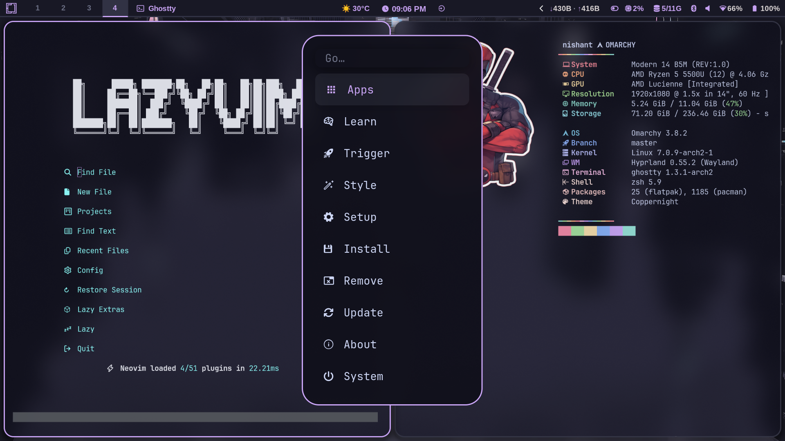

<p align="center">
  
</p>

<h1 align="center">✨ Omarchy Lavender — Omarchy 4 ✨</h1>

<p align="center">
  <b>A lavender-tinted Catppuccin Mocha rice for <a href="https://omarchy.org/">Omarchy 4</a></b><br>
  <code>omarchy theme set lavender</code> · <code>omarchy theme bg next</code>
</p>

<p align="center">
  
  
  
  
  
  
</p>

---

## ⚡ Quick Install

```bash
omarchy theme install https://github.com/hembramnishant50-glitch/omarchy-lavender-theme.git
rm -rf ~/.config/omarchy/themes/lavender/.git && omarchy theme set lavender
# file manager solid + yazi flavor
~/.config/omarchy/themes/lavender/apply-filemanager.sh
```

**One-liner (install + enable Lua):**

```bash
omarchy theme install https://github.com/hembramnishant50-glitch/omarchy-lavender-theme.git && rm -rf ~/.config/omarchy/themes/lavender/.git && omarchy theme set lavender
```

> Lua files (`hyprland.lua`, `neovim.lua`, `gum_env.lua`) are blocked for git-installed themes — the `rm -rf .git` makes the theme yours so Hyprland/Neovim/Gum use lavender.

## 🗑️ Remove File Manager Theme

```bash
~/.config/omarchy/themes/lavender/remove-gtk.sh
# manual:
rm ~/.config/gtk-3.0/gtk.css ~/.config/gtk-4.0/gtk.css && nautilus -q
```

---

## 📜 License

MIT — original lavender + Omarchy 4 port.
